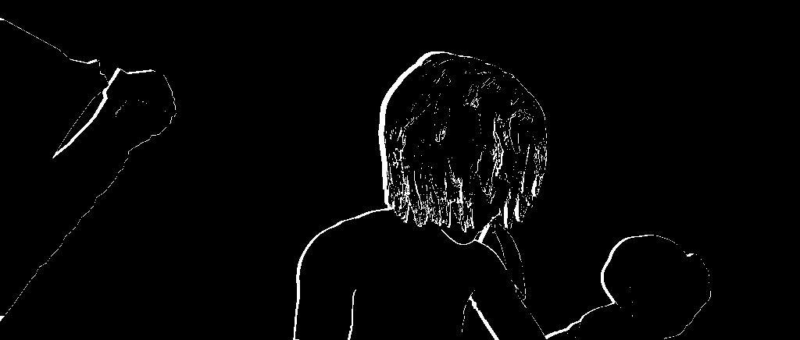

# Anisotropic Optical Flow Inpainting

This repository provides Python implementations of the anisotropic optical flow inpainting algorithms presented in the paper:

**On Anisotropic Optical Flow Inpainting Algorithms**  
*Lara Raad, Maria Oliver, Coloma Ballester, Gloria Haro, Enric Meinhardt*  
[https://doi.org/10.5201/ipol.2020.281](https://doi.org/10.5201/ipol.2020.281)

This work is a conversion of the original C and Octave/Matlab code provided by the authors. The goal is to make these algorithms adaptable for Python pipelines (ex: postprocessing optical flow predictions by a DL model).

## Algorithms

The repository includes implementations of two distinct inpainting algorithms:

1.  **Absolutely Minimizing Lipschitz Extension (AMLE):** This method recovers missing flow values using the Absolutely Minimizing Lipschitz Extension partial differential equation. We provide two Python implementations:
    *   A sequential version (`amle_inpainting_seq.py`)
    *   A parallelized version (`amle_inpainting_parallel.py`) for improved performance.

2.  **Laplace-Beltrami (LB):** This approach uses the Laplace partial differential equation defined on a Riemannian manifold to inpaint the flow field (`laplace_beltrami_inpainting.py`).

**Note** You can find the revised/annotated paper under (`article_lr.pdf`)

## Results

Here are the results of applying the algorithms to the test data provided by the original authors.

### Input Data

| Guide Image                                                              | Mask                                                              | Input Flow Visualization                                          |
| ------------------------------------------------------------------------ | ----------------------------------------------------------------- | ----------------------------------------------------------------- |
|  |  |  |

### Inpainting Outputs

| Algorithm              | Output Visualization                                                                                   | Execution Time |
| ---------------------- | ------------------------------------------------------------------------------------------------------ | -------------- |
| **Laplace-Beltrami**   |                                      | -              |
| **AMLE (Sequential)**  |  | ~1072 seconds  |
| **AMLE (Parallel)**    |    | ~708 seconds   |

## License

This work is a product of a work that is licensed under the GNU Affero General Public License. See the [LICENSE](flow_interp/LICENSE) file for details.
